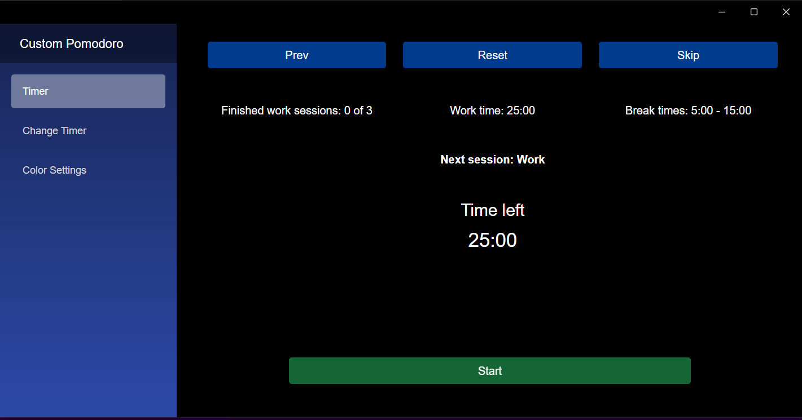
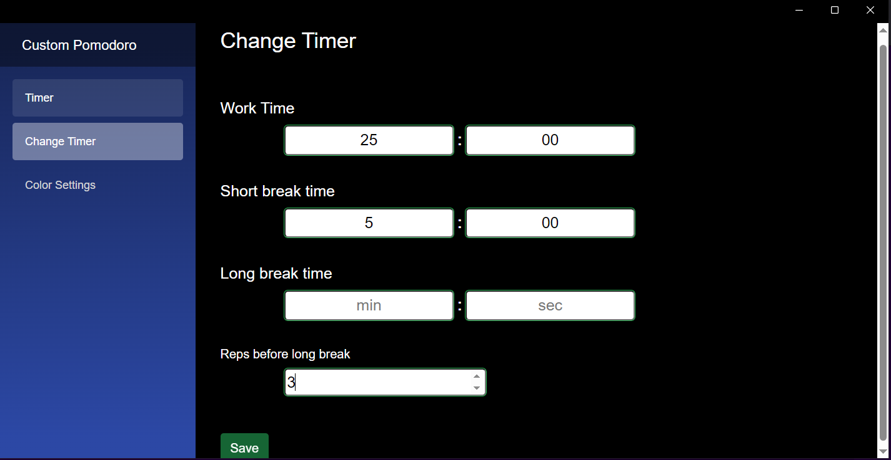
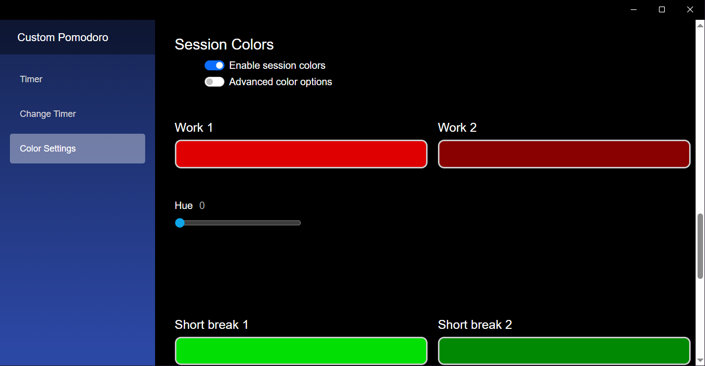

# Custom Pomodoro

A MAUI Blazor hybrid app with a customizable pomodoro timer. Developed with Windows & *Android devices in mind. WebView is required, as all pages currently make use of it.

*Disclaimer: A stable Android release is currently unavailable. A glitch currently causes the "release" version to break on Android devices. (This is a bug on the framework's behalf. Also potentially responsible for crashing Android emulators on "release" mode.) Development will be kept with Android in mind should the issue be resolved.

**Note:** If cloning this project, `localSettings.json` is currently missing from the project repo. Any default `localSettings.json` file from a default MAUI-Blazor hybrid template project can be copied into the project directory to make this project functional. (Will try to address this issue later.)

 

## Features
* Timer display 
    * Work session count & text displaying the current session type.
    * "Skip", "reset", & "next" buttons are available to move back & forth between session types. 
    * Simple timer expiration sound.
* Color options
    * Customizable background colors for "not started", "running", & "paused" timer states.
    * Customizable (optional) colors for "work", "short break", & "long break" timers.

 

Ideally, these features would be implemented in the future:
* Quick selection of previously used timers (for each type of timer).
* Choice of black, gray, or white text for the timer page.

 

## Contributions
Public contributions are not currently accepeted (as I've yet to come up with a clear workflow that would allow for that). This may change in the future.